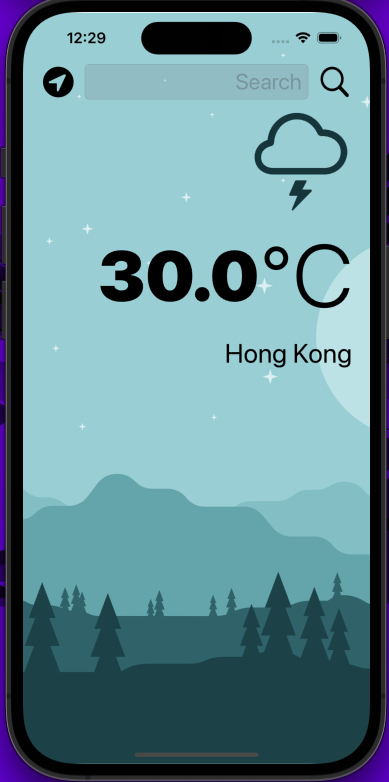
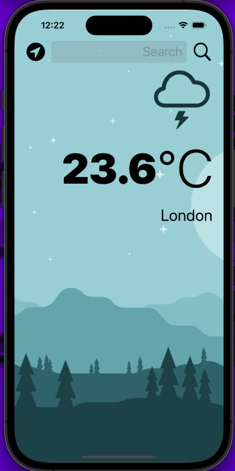
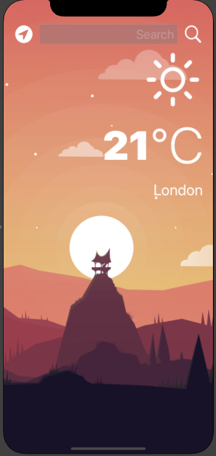
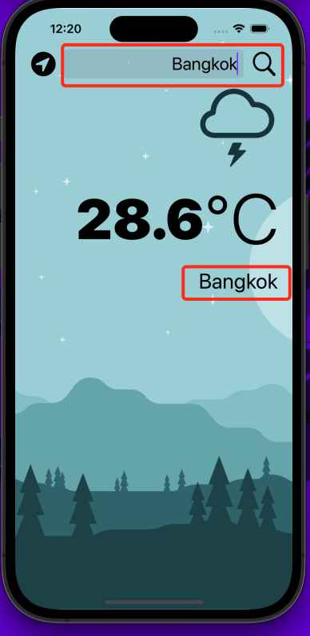
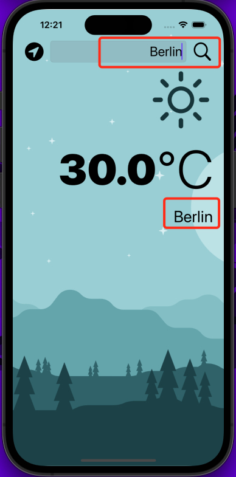
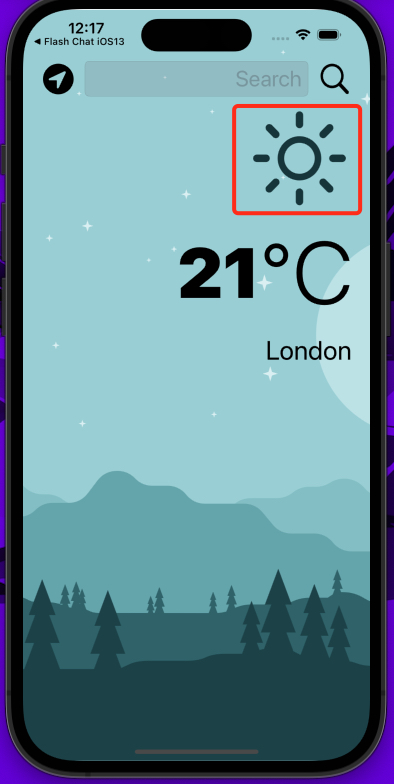
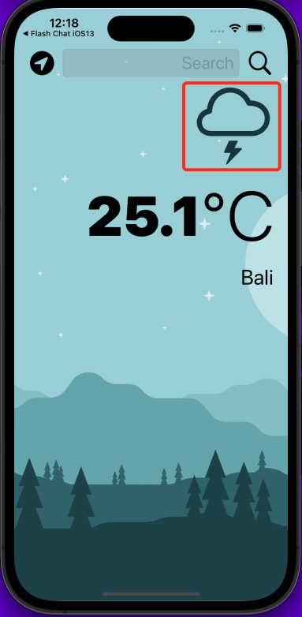
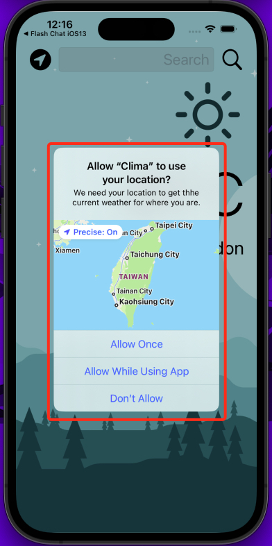
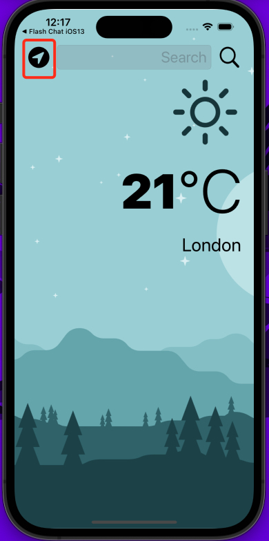

# Weather App

**Table of Contents**
- [Introduction](#introduction)
- [Motivation](#motivation)
- [Technology Used](#technologyUsed)
- [Build Status](#buildStatus)
- [Features](#features)
- [Installation](#installation)
- [Execution](#execution)

## Introduction 
Mobile weather app that uses an external API to display weather information from around the world.

## Motivation 
This is a personal learning project aimed to teach me how to use APIs to grab live data from the internal as well as parse JSON responses, get user current location and updating UI through user interaction. 

## Technology Used 
<table>
  <tbody>
    <tr>
      <td>Language</td>
      <td>Swift</td>
    </tr>
    <tr>
      <td>Notable Technology Utilized</td>
      <td>
        <ul>
          <li>Swift Language + Storyboard</li>
          <li>Creating a dark-mode enabled app</li>
          <li>Usage of vector images as image assets</li>
          <li>UITextField for user input</li>
          <li>Delegate pattern design</li>
          <li>Swift protocols and extensions</li>
          <li>Uses the URLSession to network and make HTTP requests</li>
          <li>Parse JSON with native Encodable and Decodable protocols</li>
          <li>Uses the Grand Central Dispatch to fetch the main thread</li>
          <li>Retrieval of Core Location to get the current location from the phone GPS</li>
          <li>Feature - Weather information display</li>
          <li>Feature - User able to select favourite locations</li>
        </ul>
      </td>
    </tr>
  </tbody>
</table>

## Build Status 
Project is completed.

## Features 
- Light and dark mode
- Search for location and display current weather
- Update weather icon based on location's weather 
- Ask for user's current location
- Reset weather to user's current location

### Light and dark mode

* Displays a light or dark theme based on user's device

### Search for location and display current weather

* User can use the search textbox to find weather information for a certain location
* User can press enter or use the magnifind glass icon

### Update weather image based on location's weather 

* weather image will change depending on the weather data from https://openweathermap.org/
* For example, if its cloudy at that location it will show a cloudy image

### Ask for user's current location

* Prompts the user to give permission to provide current location

### Reset weather to user's current location

* User can reset the weather to their current location

# Installation 
* Ensure XCode is installed (only available on MacOS)

# Execution 
* Open the "Clima.xcodeproj" file in XCode
* Once the project is open you can click the play button at the top of the IDE to run the iPhone simulator or use a physical device
